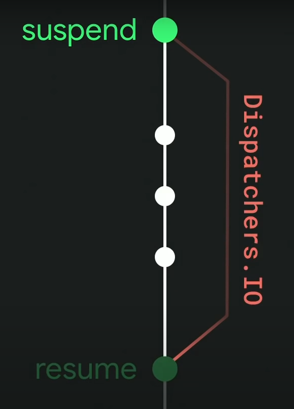

Tôi thường nghe về câu nói như : "Suspending functions are at the center of everything coroutines" (Tạm dịch: "Các hàm
tạm dừng là trung tâm của mọi thứ trong coroutines"). Vậy thì Suspend Function là gì? Tại sao nó lại quan trọng đến vậy?

Bài viết có tham
khảo: [Kotlin Coroutines — A deep dive](https://anant-raman.medium.com/kotlin-coroutines-a-deep-dive-e8c9d4451a0b), [A deep dive into Kotlin Coroutines](https://medium.com/@viniciusviana_61216/a-deep-dive-into-kotlin-coroutines-a621d2978451)

## Table of Contents

- [Coroutines capabilities](#coroutines-capabilities)
- [Suspending functions](#suspending-functions)
- [Suspending functions are at the center of everything coroutines](#suspending-functions-are-at-the-center-of-everything-coroutines)

## Coroutines capabilities

A coroutine is an instance of a suspendable computation.
It is conceptually similar to a thread, in the sense that it takes a block of code to run that works concurrently with
the rest of the code.
However, a coroutine is not bound to any particular thread. It may suspend its execution in one thread and resume in
another one.

## Suspending functions

A suspending function is a function that can be suspended and resumed at a later time.
So, what does it mean to suspended and resumed?

## Suspending functions are at the center of everything coroutines

Quay lại với [Coroutines capabilities](#coroutines-capabilities) thì coroutine được mô tả như thế này:

> It may suspend its execution in one thread and resume in another one.

Tạm dịch: coroutine có thể tạm dừng việc thực thi của nó ở một thread và tiếp tục thực thi ở thread khác.
Ở đây tôi sẽ có ví dụ như này:

```kotlin
// This function called on the main thread
suspend fun loadUser() {
    val user = api.fetchUser()  // This function called on the IO thread
    displayUser(user)
}

suspend fun Api.fetchUser(): User {
    return withContext(Dispatchers.IO) {
        // fetch user from the network
    }
}
```

> Ở đây bạn cần biết thêm về Dispatchers, tôi sẽ giải thích ở phần sau.

Lúc đó luồng hoạt đông của app sẽ như sau:

Như vậy, suspend ở đây là treo việc thực thi của coroutine ở nơi nó được gọi, và thực thi những lệnh bên trong nó.

Ồ, vậy thì nó khác gì với 1 function bình thường:

``` kotlin
private suspend fun doWorld2() {
        println("World!")
}
```

đây là đoạn mã doWorld2() sau khi được kotlin compiler biên dịch (Tôi sẽ decode sang java để dễ hiểu hơn):

``` java
private static final Object doWorld2(Continuation $completion) {
      Object var10000 = DelayKt.delay(1000L, $completion);
      return var10000 == IntrinsicsKt.getCOROUTINE_SUSPENDED() ? var10000 : Unit.INSTANCE;
   }
```

Như các bạn thấy, sau khi compiler biên dịch,suspend function doWorld2() trở thành một function bình thường
có thêm một tham số là Continuation.
Đây thực sự là gì?

> A continuation is a representation of the remaining computation after a suspension point.

Tạm dịch: Continuation là một biểu diễn của việc tính toán còn lại sau một điểm tạm dừng.
Điều này tương ứng với "Resume" trong flow chart ở trên.
Còn tương ứng trong code sẽ là:

``` java
return var10000 == IntrinsicsKt.getCOROUTINE_SUSPENDED() ? var10000 : Unit.INSTANCE;
```

Chi tiết hơn về Continuation, bạn có thể đọc thêm
ở [đây](https://medium.com/@viniciusviana_61216/a-deep-dive-into-kotlin-coroutines-a621d2978451).

Continuation sẽ dữ 1 CoroutineContext, điều này sẽ cho phép chuyển luồng ở suspend function. Do vậy, ở ví dụ
flow đầu tiên, hàm loadUser đã được gọi trên main thread, nhưng khi gọi hàm fetchUser() thì nó đã chuyển sang
IO thread. Do vậy nó sẽ không block main thread, và khi hàm fetchUser() hoàn thành, nó sẽ chuyển lại main thread.

Do vậy Suspend Function thực sự là trung tâm của mọi thứ trong coroutines. và cũng chỉ
có thể gọi suspend Function trong một coroutineScope hoặc một suspend function khác.