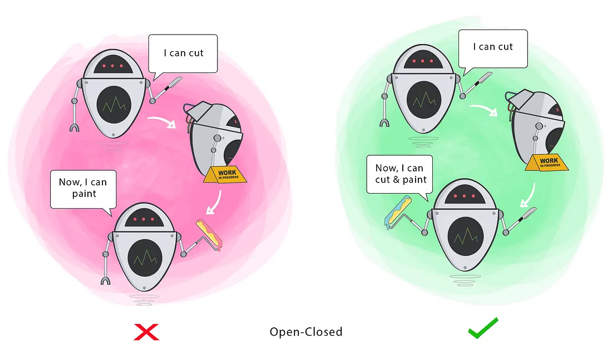

This post have reference
from [SOLID Principles](https://medium.com/backticks-tildes/the-s-o-l-i-d-principles-in-pictures-b34ce2f1e898)

## Table of Contents

[What is SOLID principles?](#what-is-solid-principles)

- [Single Responsibility Principle](#single-responsibility-principle)
- [Open/Closed Principle](#openclosed-principle)
- [Liskov Substitution Principle](#liskov-substitution-principle)
- [Interface Segregation Principle](#interface-segregation-principle)
- [Dependency Inversion Principle](#dependency-inversion-principle)
- [Understanding Low Coupling và High Cohesion](#understanding-low-coupling-và-high-cohesion)

## What is SOLID principles?

> SOLID is an acronym for the first five object-oriented design(OOD) principles by Robert C. Martin, popularly known as
> Uncle Bob.
>
> These principles, when combined together, make it easy for a programmer to develop software that are easy to maintain
> and extend.
>
> They also make it easy for developers to avoid code smells, easily refactor code, and are also a part of the agile or
> adaptive software development.

So, what is SOLID principles?

- [**S**ingle Responsibility Principle](#single-responsibility-principle)
- [**O**pen/Closed Principle](#openclosed-principle)
- [**L**iskov Substitution Principle](#liskov-substitution-principle)
- [**I**nterface Segregation Principle](#interface-segregation-principle)
- [**D**ependency Inversion Principle](#dependency-inversion-principle)

## Single Responsibility Principle

> A class should have one and only one reason to change, meaning that a class should have only one job.

## Open/Closed Principle

> Objects or entities should be open for extension but closed for modification.

## Liskov Substitution Principle

> Every subclass/derived class should be substitutable for their base/parent class.

- This principle is very rigid in theory, but in practice it cannot be applied 100%.
- Even in the Android source code there are many examples that violate this principle.

## Interface Segregation Principle

> A client should never be forced to implement an interface that it doesn’t use, or clients shouldn’t be forced to
> depend on methods they do not use.

## Dependency Inversion Principle

> Entities must depend on abstractions not on concretions. It states that the high-level module must not depend on the
> low-level module, but they should depend on abstractions.

## Understanding Low Coupling và High Cohesion
> doing...